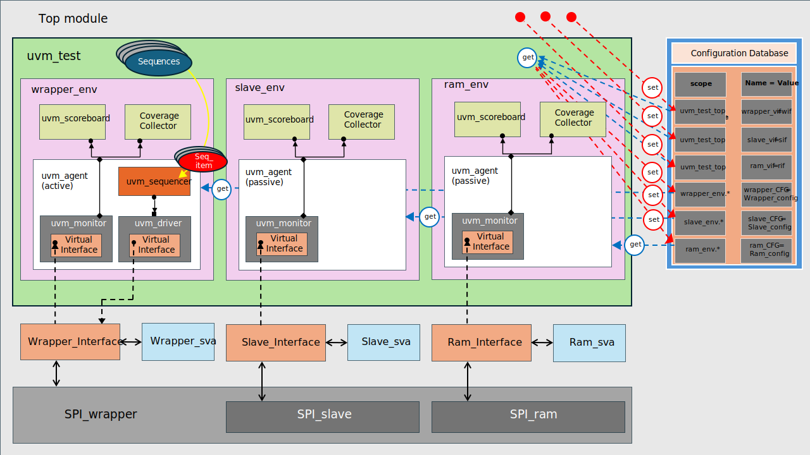

# SPI Slave with single port RAM - UVM Verification Project

This repository contains the RTL design and a complete UVM verification environment for the SPI SLave, SPI Ram and SPI Wrapper.

## Project Overview

For a complete and detailed explanation of the project, please refer to the full project document:

**[View Project PDF (SP_ Project (2).pdf)](./SPI_Slave_with_Single_port_Ram.pdf)**

## UVM Verification Architecture

